# JIT Application Access Microsoft Teams Bot Deployment Guide

This document will step you through the deployment of a Proof-of-Concept JIT Application Access Microsoft Teams bot for use with the Privilege Management Cloud platform. The bot will receive webhook data for JIT Application Access requests, present a Teams card in a specified channel, and allow for the user to interact with the card to approve or deny these requests. The deployment of the bot is accomplished via a deployment script, with a minor amount of configuration needed in Microsoft Teams itself.


## Prerequisites

There are several prerequisites to outline prior to working through the deployment. Although the script will prompt to install these below items, it is recommended that you install these prior to running the deployment scripts to ensure a successful deployment. For the SE team, this also requires an active Visual Studio Azure Credit subscription to avoid any charges for Azure usage.

### Requirements and Dependencies

- Active Azure subscription (Visual Studio Azure Credit Subscription works well, as you will also need access to the E5 licensing included with Visual Studio as well)
- An active Azure tenant outside of our BeyondTrust tenant
- 1 user who is a global administrator of this tenant
- A separate Microsoft Teams application connected back to this Azure tenant

A MSDN Visual Studio subscription includes an E5 license which can be used to support this Teams environment.

Although installing and configuring Microsoft Teams is outside the scope of this document, you can find Microsoft's documentation here:
[Assign or unassign licenses for users in the Microsoft 365 admin center - Microsoft 365 admin](https://docs.microsoft.com/en-us/microsoft-365/admin/manage/assign-licenses-to-users)

### Required Software

- **Powershell 7+**: [Installing PowerShell on Windows](https://learn.microsoft.com/en-us/powershell/scripting/install/installing-powershell-on-windows)

  Please note that this may show as a separate executable on your system once installed.

  

  This can also be installed in the context of an IDE (VSCode, etc) but for the purposes of this guide we will use the Powershell 7 application.

- **Node.js LTS** (20.11.1 or later)
  - Download: [Node.js — Run JavaScript Everywhere](https://nodejs.org/)
  - Similar to Powershell, this can also be installed via IDE if you choose

- **Git for Windows**
  - [Git - Downloading Package](https://git-scm.com/download/win)
  - Also can be installed via IDE

- **Azure CLI**
  - [Install the Azure CLI for Windows](https://docs.microsoft.com/en-us/cli/azure/install-azure-cli-windows)
  - Yep, you guessed it. Can be installed via IDE too.

### Required Azure Subscription Resource Providers

- Microsoft.Web
  - Can be added by navigating to your Azure Subscription → Settings → Resource Providers

### Required Powershell Modules

- **AZ Module** - install command (run in elevated powershell 7 console):
  ```powershell
  Install-Module -Name Az -Force -AllowClobber -Scope CurrentUser
  ```

- **Microsoft Graph** - install command (run in elevated powershell 7 console):
  ```powershell
  Install-Module -Name Microsoft.Graph -Force -AllowClobber -Scope CurrentUser
  ```

After installing all prerequisites, make sure you close any open Powershell windows and re-launch a fresh one as Administrator before proceeding.

## Deployment Script

Prior to running the deployment script, open it in an IDE or script editor (VSCode and Notepad++ are great - the native notepad app can change the line endings in some cases, breaking the code, so it is best to avoid that in this case) and modify the required variables. We'll step through that first:

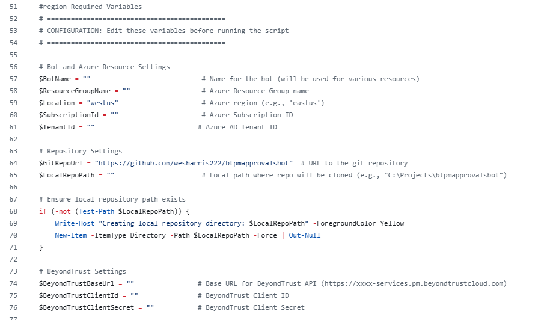

Modify the block with the required data. BotName, ResourceGroup name, and LocalRepoPath (essentially a working directory) are user-defined, as they will be created during script runtime. Note that some items, such as the $Location and $GitRepoURL are prepopulated and have comments indicating not to change them - they are editable right now for future development options, but should be left unchanged if noted.

Here is where you can find some of the above values:

**SubscriptionID:**
- Navigate to https://portal.azure.com and login as your global administrator user
- Search for 'Subscriptions' in the top search bar

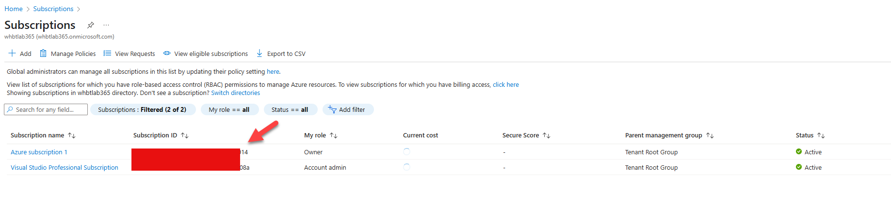

**TenantID:**
- Still in Azure, search for 'Entra ID' in the top search bar
- On the overview page of Entra ID, you'll find this value.

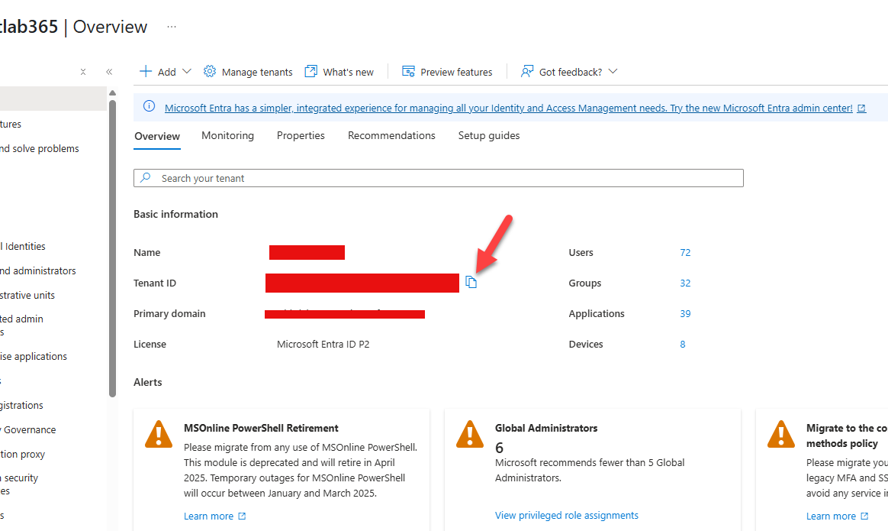

**BeyondTrust API Settings:**
- Navigate to https://demo2.pm.beyondtrustcloud.com (or a different site, although I'd recommend this one, as it should always be set to using the JIT Application workflow instead of the SNOW workflow)
- Navigate to Configuration, API Settings and create a new API Key
- Take down the Client ID and Secret, and make sure you only enable JIT Access as Full Access. No other API permissions are required.

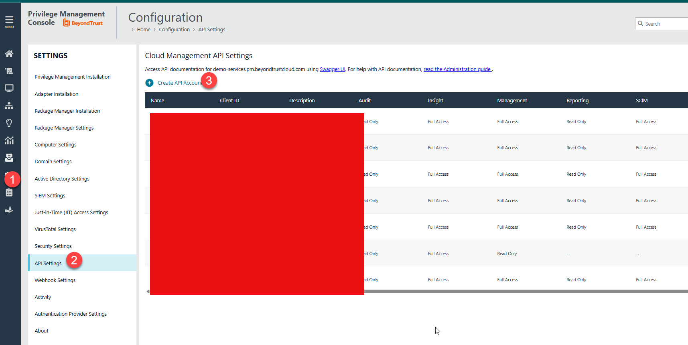

Once you have installed all dependencies and populated your variables, it is time to run the deployment script.

## Running the Script

The deployment script can be found at the bottom of this document. Copy and paste it into a tool like VSCode or Notepad++ and save as a .ps1 file. (as mentioned before, the native notepad app can sometimes convert line endings and break the code, so the other tools I mentioned are better.)

To run the script:
1. Open Powershell 7 as Administrator (see above - make sure to open the correct application)
2. Navigate to script directory and run `.\<filename>.ps1`

The script will take a long time to run - we're talking 20-30 minutes or more in some cases. This is expected. But don't go get lunch just yet…

You will be prompted for an interactive logon to Azure after the AZ and Graph modules have been installed and imported. Login with your global administrator for your Azure tenant, wait until the screen populates your subscriptions, and select your Visual Studio subscription. After you make this selection, you will be prompted to hit <Enter> - do so, and after that you can certainly go get some lunch, knit a scarf, whatever floats your boat. That will be the last interaction required until the script run is completed.

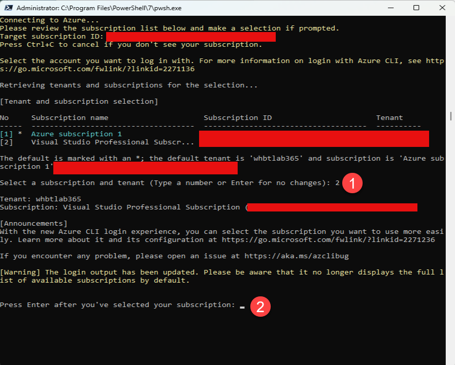

At present, you will see lots of warnings - most of them referring to 32-bit vs 64-bit python. These can be ignored. If using a 64bit Azure CLI with Python 64bit installed, you will not see these messages. You will also see significant response data from Azure - this can also be ignored. I'll revise this one I am able to address and/or suppress the warnings. A lot of text is going to be displayed while the script is running, but at this time, that is normal. After you select your subscription, you just need to wait for a while (seriously, its a while).

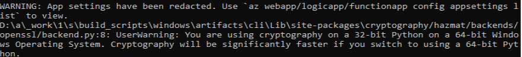

Once the script finishes, it will provide you instructions to load the app into Teams. We'll step through that via GUI, as it seems to be more user-friendly that the CLI interface.

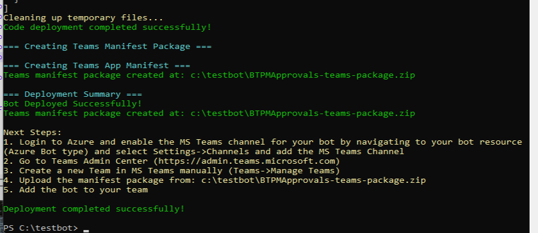

## MS Teams Configuration and Loading Bot into Teams

### Azure Bot Channel Configuration

Before jumping into the Teams admin center, you need to allow the bot to be added to MS teams in Azure. To do so, login to https://portal.azure.com with your global admin, and navigate to your newly created resource group and local your Bot resource:

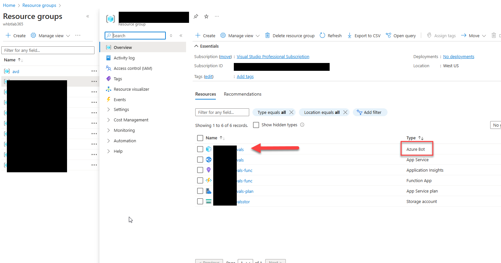

Next, navigate to Settings->Channels and select MS Teams from the list.

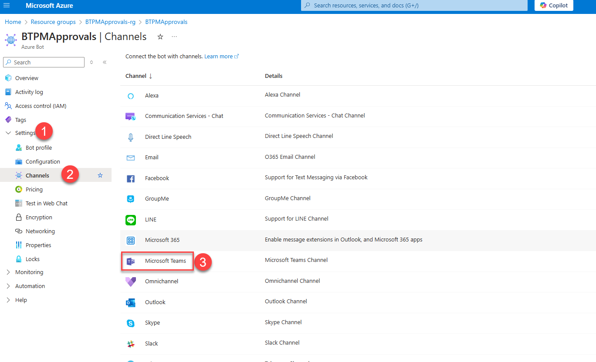

Accept the terms and hit apply with default selection. After saving, you can move on to the Teams-specific steps.

Navigate to the Teams Admin Center (https://admin.teams.microsoft.com) and login as your global admin.

Create a Team and Channel using the 'Teams->Manage Teams' menu option. Private Team is fine, along with a Standard channel. You can also use the 'General' channel that is preconfigured once you create the team itself.

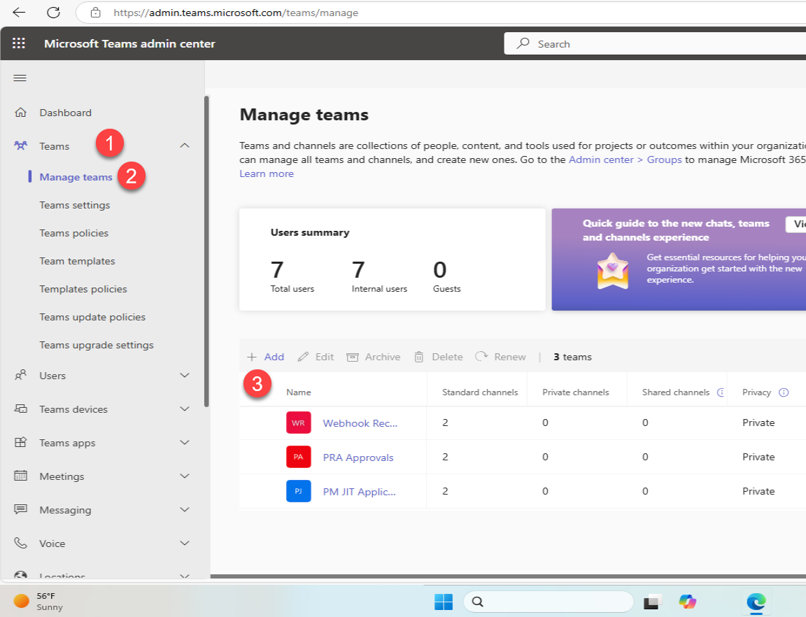

Now, move to 'Teams Apps → Manage Apps' and select 'Actions → Upload new App.' Here, you'll want to add the Teams manifest that is shown in your deployment finalization text. Upload that to MS Teams here. This makes it available for being added to your new team.

Last, Log in to the MS Teams application as your global admin user. Your new Team should show in the Teams section. Select the … icon for the Team, not channel, and select 'Manage Team.'

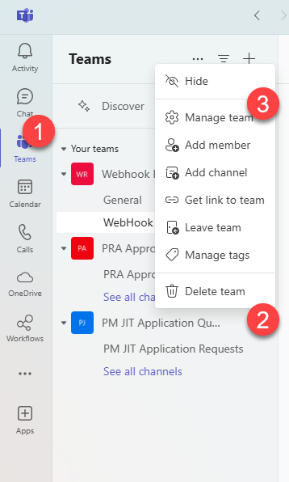

Click the 'Apps' tab across the top of the page, and then 'Get More Apps'

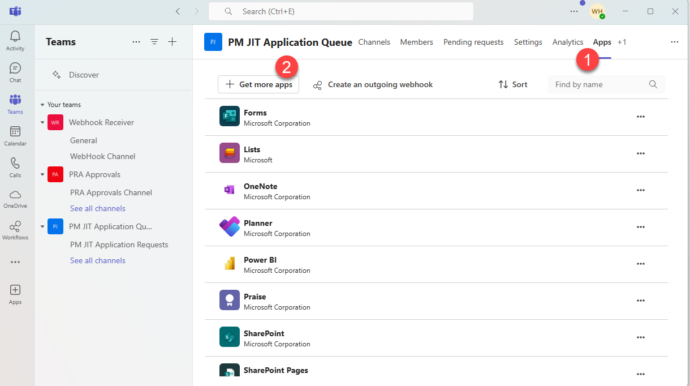

You should see your app visible in the 'Built for your org section.' Click 'Add'.

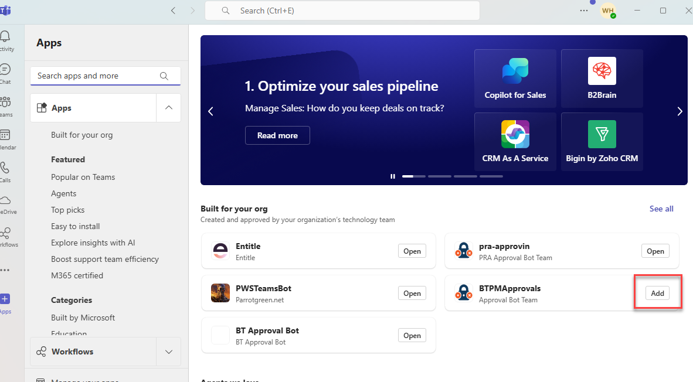

Select 'Add' again on the next page, and then select your channel from the list near the bottom of the popup, and hit 'Go.'

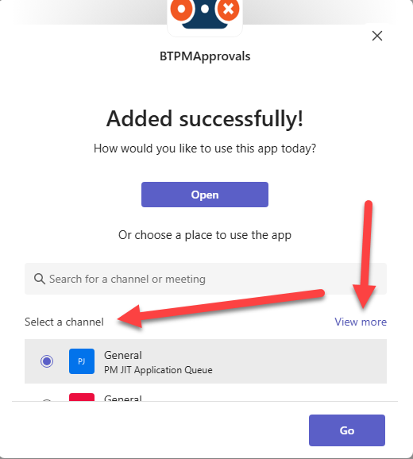

You should see a welcome message from the App. If you see the welcome message, you are good to go!

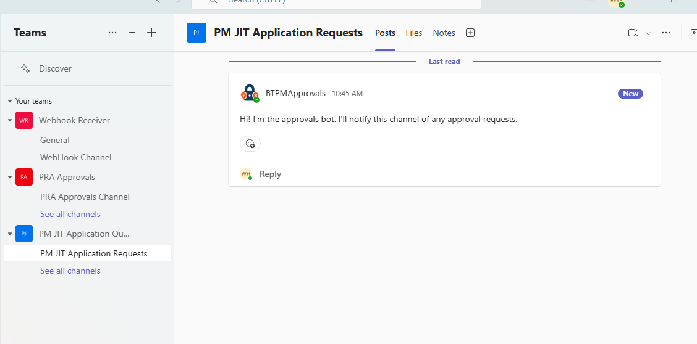

## PM Cloud Webhook Configuration

To add the webhook itself to PM Cloud, login and navigate to 'Configuration → Webhook Settings' and create a new webhook.

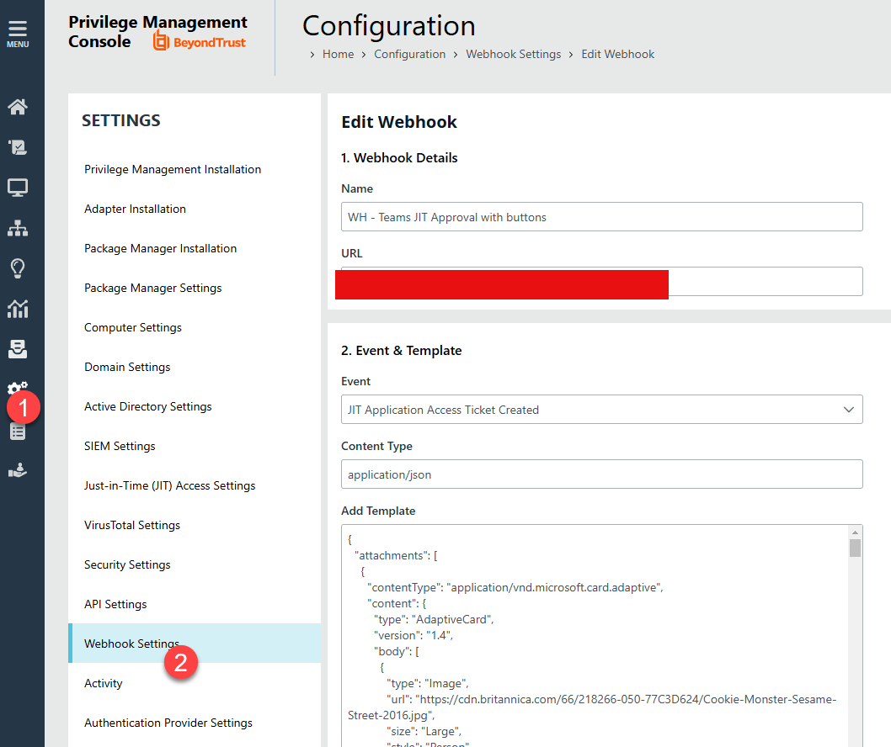

The URL value should be https://<bot name from deployment script>.azurewebsites.net/api/webhook. In the example above, the Bot name was btpmapprovals (dont use that one, as they are global names and cannot be repeated in Azure.)

Copy and paste the webhook text, below, verbatim. Save and enable.

Your bot should now be able to receive PM JIT Application Access requests.
