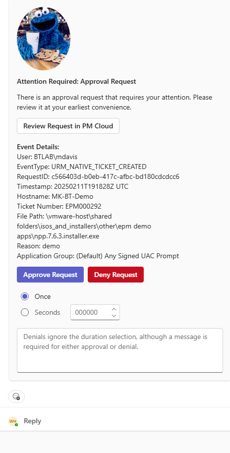

# Proof-of-Concept JIT Application Access Bot Deployment

This document will step you through the deployment of a Proof-of-Concept JIT Application Access Microsoft Teams bot for use with the Privilege Management Cloud platform. The bot will receive webhook data for JIT Application Access requests, present a Teams card in a specified channel, and allow for the user to interact with the card to approve or deny these requests. The deployment is accomplished via a PowerShell deployment script, with a minor amount of configuration needed in Microsoft Teams itself.

---

## 📸 Screenshots & Placeholders

> **Note:** All image references below use placeholders.  
> Create an `images/` folder in your repo root, add each image there (with the exact filenames), and they’ll render automatically.



---

## Prerequisites

> **Tip:** Although the deployment script will prompt to install these, we recommend installing them _before_ you begin.

- **Active Azure subscription**  
  (Visual Studio Azure Credit subscription works well, since it includes an E5 license for Teams)

- **Azure tenant** separate from BeyondTrust’s tenant  
  - 1 user with **Global Administrator** role  

- **Microsoft Teams** application connected to your Azure tenant  
  - (Teams licensing is included in the Visual Studio E5 plan)

- **PowerShell 7+**  
  - [Install PowerShell on Windows](https://learn.microsoft.com/powershell/scripting/install/installing-powershell-on-windows)  
  - Once installed, it may appear as `pwsh.exe` or “PowerShell 7” in your Start menu.


- **Node.js LTS (≥ 20.11.1)**  
  - [Download Node.js](https://nodejs.org/)  

- **Git for Windows**  
  - [Download Git](https://git-scm.com/download/win)  

- **Azure CLI for Windows**  
  - [Install Azure CLI](https://learn.microsoft.com/cli/azure/install-azure-cli-windows)  

### Required Azure Subscription Resource Providers

- `Microsoft.Web`  
  - In the Azure Portal: **Subscriptions → Your Subscription → Settings → Resource Providers** → Register **Microsoft.Web**

### Required PowerShell Modules

Run **in an elevated PowerShell 7 console**:

```powershell
Install-Module -Name Az -Force -AllowClobber -Scope CurrentUser
Install-Module -Name Microsoft.Graph -Force -AllowClobber -Scope CurrentUser
